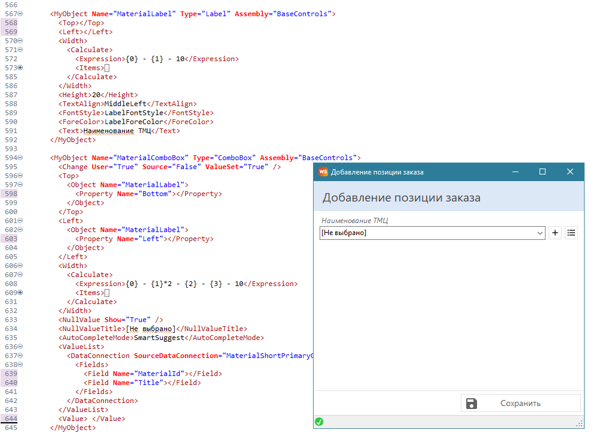

# Основы платформы

## Фреймворк 

Обобщенную схему любого корпоративного ПО можно представить следующим образом:

<figure><figcaption></figcaption></figure>

1. Интерфейс.\
   Классическая форма – карточка сущности (например, карточка клиента) – содержит поля ввода информации, которые пользователь заполняет вручную. Но эти же поля будут использоваться для отображения ранее сохраненной в базе данных информации, когда карточка сущности будет открыта для редактирования.\
   Другим примером классической формы является форма отчета, которая помимо таблиц, графиков и полей для вывода данных из базы, может содержать поля для ввода, например, поля фильтров - дата начала и дата окончания периода, за который строится отчет. Значения фильтров будут отправляться в базу для ограничения выборки данных для вывода на форме.
2. Механизмы для работы с данными и базой.\
   Такие механизмы открывают «канал связи» с базой данных, чтобы передавать данные и получать результат. Механизмы различаются тем, какие данные необходимо передавать базе через «канал»: либо это указание отправить новые данные (INSERT-запросы на языке SQL), либо изменить данные в базе (UPDATE-запросы), либо удалить данные из базы (DELETE-запросы), либо загрузить данные на форму (SELECT-запросы). Во всех случаях после отправки следует получение ответа. Даже в случае с удалением получаем ответ, что удаление выполнено успешно.
3. Алгоритмы обработки данных в базе

В рамках платформы WT мы автоматизировали разработку первых двух пунктов (интерфейс и механизмы для работы с данными и базой).

Подробное объяснение, почему разработка пункта 3 (алгоритмы обработки данных в базе) не автоматизирована в платформе WT

Если в качестве механизмов для отправки и загрузки данных используются SQL-запросы, то подразумевается, что данные в базе уже структурированы и хранятся таким образом, который позволяет их записывать и считывать с насколько это возможно минимальными затратами с точки времени выполнения SQL-запросов и времени написания этих SQL-запросов разработчиком.

При этом непосредственная обработка данных внутри базы, как правило, требуется только в больших структурах с большим объемом данных, например, для того чтобы выполнить индексацию или построить на основе сырых данных некоторую агрегированную выборку. Задачи индексации в базе данных настраиваются отдельно, и это связано с разработкой ПО только косвенно. А задача переработки сырых данных может быть выполнена сразу же следом за операцией изменения этих сырых данных – в одной транзакции (либо с помощью второго SQL-запроса, либо с помощью автоматически запускающийся функции-триггера).

В отдельных ситуациях алгоритмы обработки (переработки данных) могут запускаться по таймеру – например, в ночное время, когда нагрузка на базу данных меньше.

Если коротко, то алгоритмы обработки данных внутри базы:

1. Требуются далеко не всегда.
2. Если требуются, то зачастую могут быть выполнены за счет шаблонных механизмов индексации.
3. Если индексации недостаточно, то тогда такие алгоритмы носят сугубо индивидуальный характер (дополнительный SQL-запрос на переработку данных в момент записи данных, триггер после записи данных, функция по расписанию) и какому-либо автоматическому созданию из шаблона, как правило, не подлежат.

Для этого мы определили набор наиболее часто встречающихся технических задач, с которыми сталкивается разработчик при создании корпоративного ПО в рамках разработки интерфейса и работы с данными. Для каждой задачи написан небольшой компонент. Система компонент выстроена таким образом, чтобы они могли взаимодействовать друг с другом в общей шине данных и системе сигналов (событий), используя входящие и исходящие параметры.

Все компоненты делятся на следующие категории:

<table data-header-hidden><thead><tr><th width="266">Категория</th><th>Краткое описание</th></tr></thead><tbody><tr><td>
Графические объекты

(<a href="https://wfsys.gitbook.io/workflow-forms-syntax/workflow_forms/objects">MyObjects</a>)
</td><td>текстовое поле, числовое поле, таблица и прочие</td></tr><tr><td>
Условия

(<a href="https://wfsys.gitbook.io/workflow-forms-syntax/workflow_forms/conditions">Conditions</a>)
</td><td>условия сравнения (например, проверка на «равно», на «больше», на «меньше») и событийные условия (например, клик мышкой или нажатие клавиши на клавиатуре)</td></tr><tr><td>
Команды

(<a href="https://wfsys.gitbook.io/workflow-forms-syntax/workflow_forms/commands">Commands</a>)
</td><td>команда отправки Email, команда закрытия формы, команда экспорта в Excel, «распечатать» и прочие</td></tr><tr><td>
Соединения с данными

(<a href="https://wfsys.gitbook.io/workflow-forms-syntax/workflow_forms/dataconnections">DataConnections</a>)
</td><td>загружающее соединения с данными для получения данных с сервера, отправляющее соединение с данными для сохранения данных на сервер</td></tr><tr><td>
Запросы к базе данных

(<a href="https://wfsys.gitbook.io/workflow-engine-syntax/workflow_engine/sql_queries">SqlQueries</a>)
</td><td>SQL-запросы для чтения и записи данных в базе</td></tr><tr><td>
Права доступа

(<a href="https://wfsys.gitbook.io/workflow-engine-syntax/workflow_engine/permissions">Permissions</a>, <a href="https://wfsys.gitbook.io/workflow-engine-syntax/workflow_engine/roles">Roles</a>, <a href="https://wfsys.gitbook.io/workflow-engine-syntax/workflow_engine/groups">Groups</a>)
</td><td>разрешения на выполнение SQL-запросов, роли и группы пользователей</td></tr></tbody></table>

Компоненты по категориям и по назначению объединены в библиотеки, которые сформировали полноценный фреймворк.

## XML-язык 

Разработка собственных фреймворков и/или использование готовых – классический путь для ускорения разработки, которым идут многие компании, но мы пошли дальше, и каждый компонент из фреймворка обернули в XML-интерфейс – то есть для каждого компонента создано декларативное XML-описание, которое используется в обычном текстовом файле формата XML. Другими словами, код программы пишется не на исходном языке программирования (C#), а в простом XML-файле.

Указывая заголовок компонента в XML и набор его параметров, определяющих его характеристики и поведение, мы тем самым вызываем код компонента, зашитый в нем, передавая ему определенные указания, как именно он должен работать. И т.к. в качестве параметров могут быть переданы ссылки на другие компоненты, то получается, что разработанная система программирования напоминает конструирование из блоков – проще говоря, конструктор.

<figure><figcaption></figcaption></figure>

Таким образом, разработка ПО на базе фреймворка сводится к описанию работы программы с помощью XML-файлов, которые теперь выполняют роль исходного кода. Правила написания этих файлов составляют синтаксис и семантику нового XML-языка программирования – Workflow Technology Markup Language (WTML).

Объяснение, почему язык WTML самодостаточен

Например, если разработчику в процессе создания ПО потребуется функциональность, которой нет ни в одном из штатных компонентов фреймворка, то он может создать свой собственный компонент на языке C#, обернув его в XML-интерфейс и таким образом встроив его как в действующую структуру платформы WT, так и языка WTML.

Готовые XML-файлы на языке WTML не требуют компиляции и передаются на вход специальным [программам-трансляторам](platform-architecture.md#translators), которые, используя полученные XML-инструкции, динамически строят программное решение с указанной логикой работы и внешним видом.

## XML-редактор 

В отличие от императивных языков (таких как C#, C++, Java) декларативные языки (в частности, XML) имеют жесткие синтаксические конструкции, а также ограниченный набор лексем (в языке программирования – «слово»). Такой подход дает возможность использовать [специальный XML-редактор Workflow XML Editor](platform-architecture.md#workflow-xml-editor), который позволяет писать XML-код с помощью фиксированных подсказок, что значительно ускоряет процесс разработки.

<figure><figcaption>
Подсказка имени get-проперти объекта
</figcaption></figure>

<figure><figcaption>
Подсказка имени объекта
</figcaption></figure>

<figure><figcaption>
Подсказка команды
</figcaption></figure>

### Паттерны 

Для дополнительного ускорения написания кода разработчик на платформе WT имеет возможность создавать паттерны (или использовать уже готовые). Паттерн – это набор часто используемых вместе компонентов XML. Простой пример: паттерн, состоящий из 4 графических объектов: надпись, выпадающий список и 2 кнопки управления.

<figure><figcaption>
Выбор паттерна
</figcaption></figure>

<figure><figcaption></figcaption></figure>

<figure><figcaption>
Фрагмент кода и готовая форма
</figcaption></figure>

Более подробно различные паттерны и их применение рассмотрены в уроках:

* Урок 3 - [Создание объектов формы](https://wfsys.gitbook.io/wt-practice/main/lesson_combo_box#sozdanie-obektov-formy)
* Урок 9 - [Форма списка и карточка редактирования](https://wfsys.gitbook.io/wt-practice/main/lesson_categories_list#list-form-and-edit-form)
* Урок 10 - [Паттерн редактируемого выпадающего списка](https://wfsys.gitbook.io/wt-practice/main/lesson_pattern_add-edit#pettern-of-editable-combobox)

### Конструкторы 

Также для ускорения разработки разработчик может использовать специальные конструкторы – например, конструктор «карточка сущности», который позволяет, описав в иерархическом виде состав формы (какие графические объекты будут отображены и в какие вложены), сразу сгенерировать ее XML-код.

<figure><figcaption></figcaption></figure>

<figure><figcaption></figcaption></figure>

Более подробно конструктор «карточка сущности» рассмотрен в [уроке 27](https://wfsys.gitbook.io/wt-practice/advanced/lesson_form_builder).

## Состав платформы 

Итого, платформа Workflow Technology – это:

1. Фреймворк WT – набор компонент, разработанных на C#, для разработки корпоративного ПО.
2. WTML – XML-язык, который вызывает компоненты фреймворка WT.
3. Workflow XML Editor – XML-редактор, который позволяет удобно писать код на WTML.

## За счет чего обеспечиваются преимущества платформы 

Теперь, зная предпосылки создания платформы WT и ее состав, можно объяснить ее преимущества:

**1. Высокая скорость разработки ПО** обеспечивается за счет следующих факторов:

* Разные функциональные алгоритмы (например, загрузка данных из базы) и элементы интерфейса «упакованы» в компоненты. Каждый компонент – маленькая программа, у которой есть входы и выходы.
* Все приложения на платформе WT строятся из компонент, обеспечивая бóльшую функциональность при тех же трудозатратах, поскольку используются готовые подпрограммы из этих компонент. Разработан механизм взаимодействия этих компонент по входу-выходу – так, что они легко между собой стыкуются.
* Программирование (стыковка компонент) происходит в декларативном (описательном) виде в XML-файлах.
* XML-файлы удобно редактируются в специальном XML-редакторе, который позволяет быстро состыковывать компоненты. Возможность написания кода в XML-редакторе обеспечивается за счет того, что декларативный XML-язык легко поддается формализации – его можно описать с помощью простых синтаксических правил. А скорость стыковки XML-компонент обеспечивается за счет того, что XML-редактор «подсказывает», какая синтаксическая конструкция может быть написана в конкретном месте кода.
* XML-редактор имеет возможность вставлять код не только по «подсказкам», но и целые куски программы (готовые комбинации компонент), оформленные в виде паттернов (создание целой формы или нескольких форм), а также содержит удобный конструктор для проектирования типовых форм.

Таким образом, компонентная структура уже сама по себе ускоряет разработку, быстрая стыковка компонент делает разработку быстрее, а применение готовых комбинаций компонент и конструкторов – еще быстрее.

**2. Низкий квалификационный порог входа для разработчиков** достигается за счет отсутствия необходимости писать код на «сложном» императивном языке (например, C#). Процесс программирования на WT – это написание кода в XML-файлах, декларативное программирование. В отличие от императивного программирования, которое применяется в обычных средах разработки, декларативное – по определению более прозрачно и читаемо для разработчика, что значительно упрощает смысловое понимание исходного кода и простоту его освоения. Все, что нужно знать перед тем, как начать писать на WT, – только SQL.

**3. Быстрое обучение новых разработчиков** является следствием небольшого количества категорий компонент в XML-языке. Несмотря на то, что в WT около 250 компонент, чаще всего используются только 50 (остальные 200 – достаточно узко специализированные). Все компоненты сгруппированы в 6 категорий (6 типов синтаксических конструкций). Достаточно понять, как работает каждая категория – внутри категории компоненты очень похожи, поэтому освоить основную функциональность платформы можно быстро. Кроме того, «терминология» разработки на платформе WT соответствует «классическим» терминам программирования («объекты», «команды», «условия» и прочее), общепринятым в отрасли, что облегчает восприятие нового материала.

**4. Гибкость разработки** реализуется за счет:

* "Небольшого размера" компонентов платформы.
* Независимости компонентов от предметной области разрабатываемого ПО.
* Расширяемости платформы WT – возможности создания собственных модулей на языке C#, которые будут легко встроены в платформу WT.

**5. Кроссплатформенность** обеспечивается за счет того, что в платформе WT реализовано 3 типа трансляторов для клиентской части: десктопный, веб и мобильный.

<figure><figcaption></figcaption></figure>

Каждый из трех клиентских трансляторов принимает для работы соответствующие XML-файлы. Для веб- и мобильной разработки за основу взят десктопный XML-язык, поэтому все XML-языки для описания логики работы клиентских частей WT-приложений на разных аппаратных платформах друг от друга практически не отличаются. Отличия между версиями языков обусловлены тем, что у каждого из них отличаются платформо-ориентированные графические объекты и зависящие от них свойства. Например, в десктопной и веб-платформах есть поле со множественным выбором из выпадающего списка, чего нет в мобильной платформе, в мобильной – напротив, есть объект в виде переключателя (аналог «галочки»), которого нет в десктопе и вебе. Однако все остальные компоненты (условия, команды, соединения с данными, запросы, права доступа) – выглядят и работают одинаково и не зависят от аппаратной платформы, для которой ведется разработка на WT. Более того, серверная часть для всех клиентских трансляторов – общая, что упрощает и ускоряет разработку сразу под несколько аппаратных платформ.

**6. Простое внедрение и поддержка** решений, разработанных на базе WT обеспечивается:

* Утилитой Workflow Installer – которая разворачивает решение, разработанное на платформе WT, в инфраструктуре заказчика в 2 клика.
* Системой автоматических обновлений Workflow Updater.

Коротко о работе системы автоматических обновлений Workflow Updater:

* Разработчик заливает разработанное решение на сервер обновлений Workflow Updater.
* В дистрибутиве решения указывается IP-адрес сервера обновлений.
* После установки решения у заказчика решение периодически опрашивает сервер обновлений на наличие новых версий.
* Если разработчик заливает очередное обновление решения на сервер обновлений, то решение у заказчика его автоматически скачивает и устанавливает.

Дополнительные преимущества мобильной версии платформы WT:

**7.** **Обновление мобильного приложения без модерации** со стороны магазина приложений. Одна из проблем у разработчиков мобильных приложений – это многочисленные проверки и модерации при публикации и обновлении приложений в магазинах (особенно в AppStore). На платформе WT эта проблема решена: теперь любое обновление можно проводить без прохождения этапов модерации со стороны магазина. Это возможно за счет того, что в магазинах приложений размещается программа-транслятор Workflow MobileForms, код которого от заказчика к заказчику не меняется и его нужно обновлять только по мере обновления самой платформы WT. При этом транслятор Workflow MobileForms при первом запуске на устройстве определенного пользователя просит указать путь до сервера, откуда скачивает все XML-файлы, в которых запрограммирована логика работы и вид интерфейса определенного приложения.

**8. Одно и то же мобильное приложение** может иметь **индивидуальную функциональность**. Как следствие того, что в магазине приложения размещается не само приложение, а лишь транслятор, появляется еще одно важное преимущество мобильной платформы WT – это возможность обновлять мобильное приложение для каждого заказчика индивидуально: все скачивают одно и то же приложение в магазине, но вид и функциональность могут быть настроены отдельно для каждого, т.к. сервер, с которого будет скачиваться обновление, у каждого заказчика свой. При первом запуске мобильного приложения потребуется только ввести имя сервера (или его IP-адрес).
