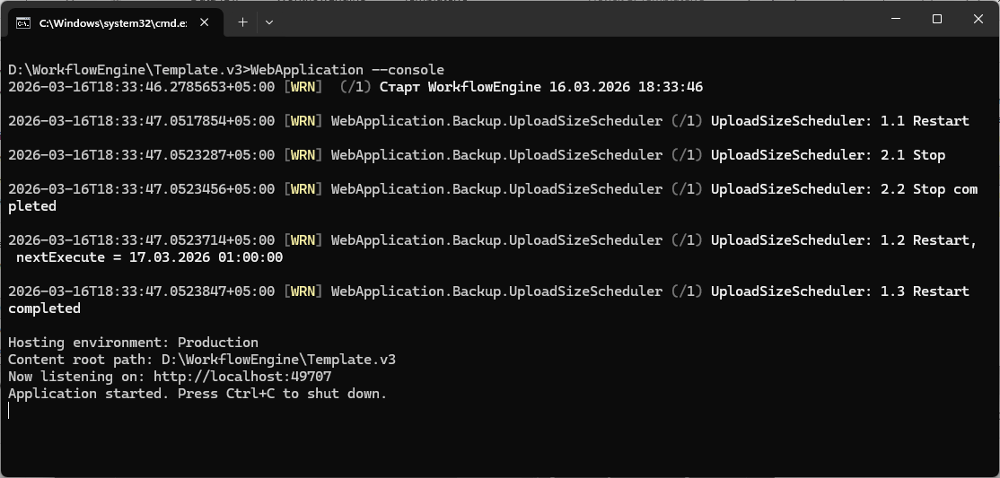

# Добавление web-приложения

В этой статье рассмотрим, как настроить сервер, чтобы можно было взаимодействовать с web-приложением через браузер.

Процесс добавления web-приложения будет рассматриваться относительно учебного проекта, с которым познакомились в статье [Учебный проект](../educational-project.md).

## План <a href="#plan" id="plan"></a>

К этому моменту серверная часть WT-программы уже должна быть развернута и настроена. Как это сделать, рассматривалось в статье [Развертывание проекта](./) в разделах [Этап 1](./#step-1) и [Этап 2](./#step-2) .

1. В папке с развернутой серверной частью создать папку \Web, в которой будут храниться бинарники для web-приложения.\
   Например, D:\WorkflowEngine\Template\Web.
2. Скопировать стандартный конфигурационный файлы appsettings.json из папки config [архива](adding_web-app.md#archive) в папку D:\WorkflowEngine\Template\Web.
3. В файл конфигурации D:\WorkflowEngine\Template\Web\appsettings.json внести правки:
   * В поле ServerUrl проверить, совпадает ли указанный адрес с тем, на котором запущена серверная часть WT-приложения. При несовпадении указать верный путь.
   * В поле HostUrl указать адрес и порт, на котором будет запущено web-приложение.
   * В поле XmlFolder проверить, совпадает ли указанный путь до папки WebForms с тем, по которому располагается папка с xml-файлами форм web-приложения. По умолчанию это папка  \1. Template\WebForms. При несовпадении указать верный путь.
   * В полях AnonymousUserName и AnonymousPassword прописать WS\_GUEST и 123 соответственно. В базе данных в таблице public.user для пользователя WS\_GUEST проверить хэш пароля.
4. Скопировать штатные бинарники из папки bin [архива](adding_web-app.md#archive) в папку D:\WorkflowEngine\Template\Web.
5. В папке \Template\Projects\1. Template\Web разархивированного учебного проекта запустить Template.sln и пересобрать решение.
6. Из папки _\1. Template\Web\Template\bin\Debug\net6.0_, куда отправляются файлы после сборки решения, скопировать файл Template.dll и добавить в папку D:\WorkflowEngine\Template\Web.
7. Скопировать файл \_start.bat из [архива](adding_web-app.md#we-archive) в папку D:\WorkflowEngine\Template\Web.
8. Для удобства запуска серверной части создать ярлык на файл D:\WorkflowEngine\Template\Web\\\_start.bat, переименовав его (например, в Template WEB).


Далее подробнее рассмотрим каждый пункт плана.

При возникновении ошибки в процессе разворачивания проекта вернитесь к этому плану и проверьте каждый его пункт.

## Архив <a href="#archive" id="archive"></a>

Скачайте бинарники нужной разрядности:

<table data-card-size="large" data-view="cards"><thead><tr><th></th><th data-hidden data-card-target data-type="content-ref"></th></tr></thead><tbody><tr><td>WorkflowWebForms_x64.zip</td><td></td></tr><tr><td>WorkflowWebForms_x86.zip</td><td></td></tr></tbody></table>

Независимо от разрядности структура папок и файлов будет одинаковая. Основные элементы архивов:

<figure><figcaption></figcaption></figure>

Web-приложение построено на базе .Net Core 6.0, что позволяет сделать его портативным. Поэтому в папке **bin** лежат все необходимые dll-файлы, чтобы на клиентском сервере не приходилось отдельно устанавливать .NET Core SDK.

В папке **config** лежит конфигурационный файл [appsettings.json](https://wfsys.gitbook.io/wt-knowledge-base/platform-wt/configuration-files/web/appsettings-json), хранящий настройки доступа к web-приложению и адрес серверной части.

Файл **\_start.bat** запускает наше web-приложение.

## Разворачивание и настройка <a href="#deployment-and-configuration" id="deployment-and-configuration"></a>

В папке, в которую [развернули серверную часть](https://wfsys.gitbook.io/workflow-technology/setting-up-dev-environment/manual-deployment-project#we-deployment-and-configuration), например, D:\WorkflowEngine\Template, создадим папку Web, в которой будут храниться бинарники для web-приложения.\
Например, D:\WorkflowEngine\Template\Web.

### Настройка конфига <a href="#setting-up-config" id="setting-up-config"></a>

Скопируем стандартный конфигурационный файлы appsettings.json из папки config [архива](adding_web-app.md#archive) в папку D:\WorkflowEngine\Template\Web.

В файл конфигурации web-приложения D:\WorkflowEngine\Template\Web\appsettings.json внесем правки:

* В поле **ServerUrl** укажем IP-адрес (или доменное имя) и порт серверной части WT-программы, к которой будет обращаться web-приложение. Этот адрес указывали в файле _D:\WorkflowEngine\Template\hosting.json_ в поле **server.urls**
* В поле **HostUrl** укажем IP-адрес (или доменное имя) и порт, на котором будет запущено web-приложения и доступно для вызова в браузере.
* В поле **XmlFolder** укажем абсолютный путь до папки WebForms с xml-файлами форм web-приложения.  Например, D:\WT\Projects\Template\Projects\1. Template\WebForms.
* В полях AnonymousUserName и AnonymousPassword пропишем WS\_GUEST и 123 соответственно. В базе данных в таблице public.user для пользователя WS\_GUEST проверим хэш пароля.

```json
"ServerUrl": "http://localhost:49707",
"HostUrl": "http://localhost:49708",
"XmlFolder": "D:\\WT\\Projects\\Template\\Projects\\1. Template\\WebForms",
"AnonymousUserName": "WS_GUEST",
"AnonymousPassword": "123",
```

Если необходимо для пользователя WS\_GUEST изменить пароль в базе данных, выполним запрос:

```sql
CREATE EXTENSION pgcrypto;

UPDATE public.user
SET user_password = encode(digest('new_password', 'sha512'), 'hex') 
WHERE user_name = 'WS_GUEST';

DROP EXTENSION pgcrypto;
```

Этот же пароль необходимо указать и в файле конфига.

### **Подготовка бинарников** <a href="#preparing-bin" id="preparing-bin"></a>

В новую папку D:\WorkflowEngine\Template\Web скопируем штатные бинарники из папки bin [архива](adding_web-app.md#archive).

В папке \Template\Projects\1. Template\Web разархивированного учебного проекта запустим Template.sln и пересоберем решение для сборки исполнительного файла web-приложения на основе razor-страниц.

Из папки _\1. Template\Web\Template\bin\Debug\net6.0_, куда отправляются файлы после сборки решения, скопируем файл Template.dll и добавить в папку D:\WorkflowEngine\Template\Web развернутой серверной части.

Скопируем файл \_start.bat из [архива](adding_web-app.md#we-archive) в папку D:\WorkflowEngine\Template\Web. Для удобства запуска серверной части создадим ярлык на файл D:\WorkflowEngine\Template\Web\\\_start.bat, переименовав его (например, в Template WEB).


Проверим, что запущена [серверная часть WT-программы](https://wfsys.gitbook.io/workflow-technology/setting-up-dev-environment/manual-deployment-project#server). При необходимости запустим.

<figure><figcaption></figcaption></figure>

Запустим web-приложение.

<figure><figcaption></figcaption></figure>

В браузере обратимся по адресу [http://localhost:49708](http://localhost:49708) (при необходимости укажите свой порт) к нашему web-приложению и проверим, что приложение доступно:

<figure><figcaption></figcaption></figure>

Отлично! Web-приложение успешно работает.
