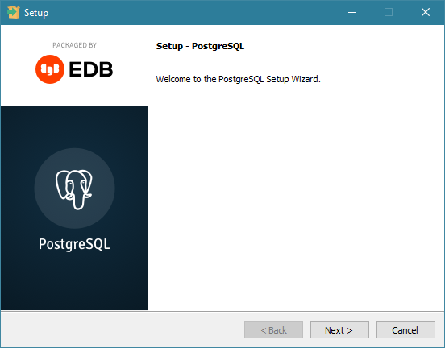
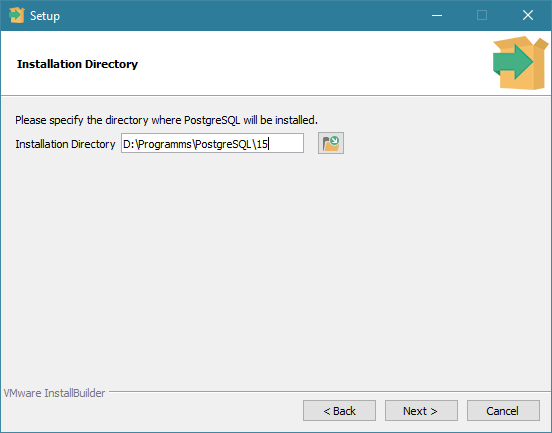
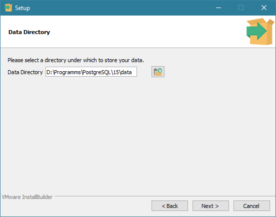
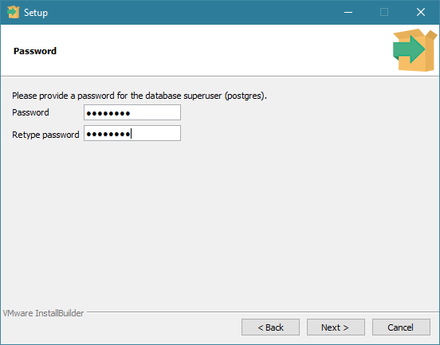
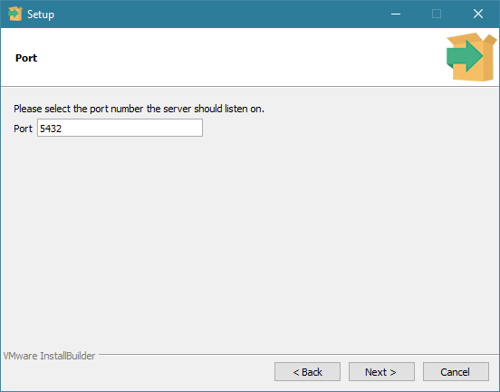
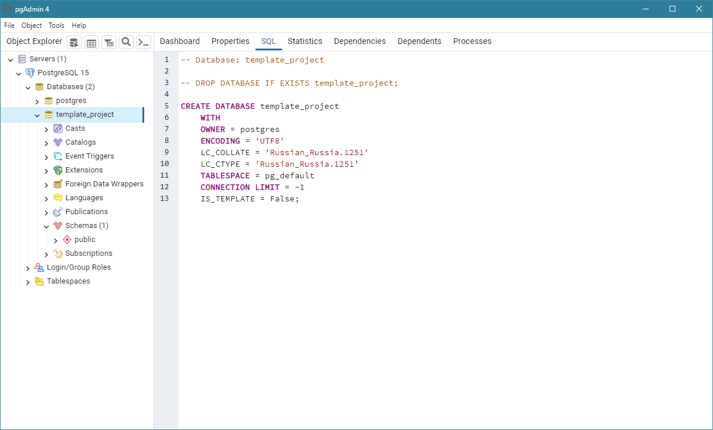

# Установка PostgreSQL

## Загрузка и установка 

Для загрузки файлов перейдите на [сайт разработчиков](https://www.enterprisedb.com/downloads/postgres-postgresql-downloads) и выберете нужную версию.

Запустите скачанный файл для начала процесса установки.

<figure><figcaption></figcaption></figure>

На первом шаге укажите папку, в которую будет устанавливаться PostgreSQL.

<figure><figcaption></figcaption></figure>

Затем выберите те компоненты, которые будут установлены.

* **PostgreSQL Server** – сервер СУБД;
* **PgAdmin 4** – графический интерфейс для администрирования серверов СУБД;
* **Stack Builder** – дополнительные инструменты для разработки (для учебного проекта они не нужны);
* **Command Line Tools** – инструменты командной строки. необходимы для работы сервера баз данных. Без этого пункта продолжение установки невозможно.

<figure><figcaption></figcaption></figure>

Укажите папку для хранения данных.

<figure><figcaption></figcaption></figure>

Теперь необходимо задать пароль для суперпользователя **postgres** (он создается по умолчанию). Этот пароль необходим для доступа к серверу СУБД при работе через pgAdmin.

Под пользователем **postgres** серверная часть WT-программы будет отправлять запросы к базе данных. Настройки пароля этого пользователя задаются в серверном файле конфигурации **appsettings.json** в поле [Database](https://wfsys.gitbook.io/wt-knowledge-base/platforma-wt/configuration-files/appsettings.json#database).

По умолчанию в файле прописан пароль **postgres**. Этот пароль укажите в окне настроек пароля. Если хотите задать свой пароль, то _запишите его или запомните_ - при разворачивании учебного проекта в файл appsettings.json укажите новый пароль.

<figure><figcaption></figcaption></figure>

На следующем шаге укажите порт, на котором будет запущен сервер СУБД.

<figure><figcaption></figcaption></figure>

Выберете локализацию. По умолчанию будет установлена англоязычная локаль.

<figure><figcaption></figcaption></figure>

Еще раз проверьте все настройки установки.

<figure><figcaption></figcaption></figure>

СУБД PostgreSQL и необходимые компоненты готовы к установке.

<figure><figcaption></figcaption></figure>

Установка успешно завершена.

<figure><figcaption></figcaption></figure>

## pgAdmin 4

Редактор PgAdmin служит для упрощения управления базой данных PostgresSQL в понятном визуальном режиме.

Запустите редактор PgAdmin 4.

<figure><figcaption></figcaption></figure>

Для доступа к серверу СУБД нужно ввести пароль суперпользователя postgres, который задавали при установке.

<figure><figcaption></figcaption></figure>

### Создание базы данных 

В окне **Object Explorer** разверните дерево **Servers** и правой кнопкой мыши кликните по узлу **Databases**. В появившемся контекстном меню выберите пункт **Create -> Database...** для открытия окна создания базы данных.

<figure><figcaption></figcaption></figure>

В открывшемся окне введите имя базы данных, например, **template\_project**. Этого достаточно, чтобы создать базу данных с настройками по умолчанию.

<figure><figcaption></figcaption></figure>

В результате будет создана база данных с одной схемой _public_ по умолчанию.

<figure><figcaption></figcaption></figure>

### Восстановление бэкапа базы данных 

В окне **Object Explorer** выберите ранее созданную базу данных, кликните по ней правой кнопкой мыши и в появившемся контекстном меню выберите пункт **Restore...** для восстановления из резервной копии.

<figure><figcaption></figcaption></figure>

Откроется окно восстановления базы, где можете задать параметры восстановления, в частности выбрать файл резервной копии.

<figure><figcaption></figcaption></figure>

### Возможная проблема

Если при восстановлении резервной копии, возникла ошибка:

<figure><figcaption></figcaption></figure>

Повторите восстановление с настройками:

<figure><figcaption></figcaption></figure>

